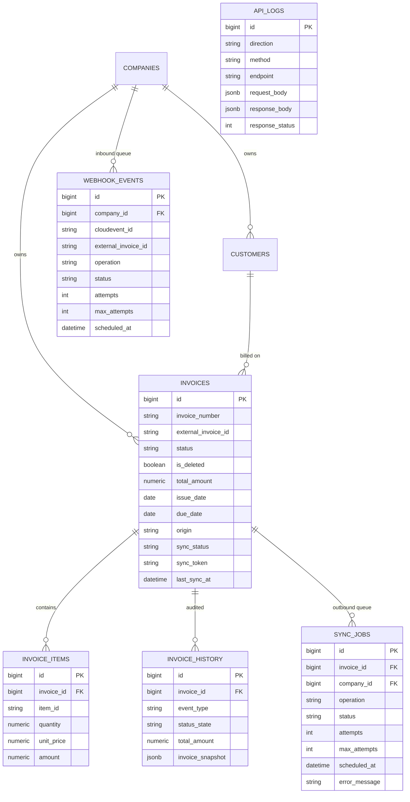

# Two-Way Invoice Sync — Design Write-Up

---

## Context

The internal invoicing system (`ideaas`) needs to stay in sync with QuickBooks Online (QBO) so that customers can work in either system without diverging records. Right now, invoices created locally don't exist in QBO and vice versa — reconciliation is manual and error-prone.

This service automates that sync for the full invoice lifecycle: create, update, delete, and void. It handles the two hardest parts of this problem — making the sync safe to retry and detecting when both sides have been edited concurrently — rather than just doing a best-effort fire-and-forget push.

---

## Goals

- Two-way sync of invoice create / update / delete / void between `ideaas` and QBO.
- Idempotent ingestion of inbound webhook events and idempotent retry of outbound writes.
- Detect and flag concurrent-edit conflicts rather than silently overwriting either side.
- Append-only audit trail of every write that crosses the system boundary.
- Safe operation with multiple worker processes running concurrently.

## Non-Goals

- OAuth token refresh. The mock accepts any bearer token.
- Webhook HMAC signature verification (`intuit-signature`).
- Customer, item, or company sync. Only invoices and their line items.
- Payment modelling. `Invoice.status` does not include `Paid` or `Partial`, and the schema has no `balance` field. Extending to handle partial payments would mean (a) adding `Paid`/`Partial` to the status state machine, (b) tracking `balance_remaining` as a first-class field, (c) treating `balance_remaining` as a conflict-detection field alongside `TotalAmt` in `_diff_against_intent`, and (d) rejecting line-item edits on `Partial` invoices with a `409` — amount changes after a payment has been recorded need their own reconciliation flow.
- A conflict resolution UI. Conflicts are flagged and require manual inspection via `invoice_history`.

---

## Overview

Changes on either side flow through a shared Postgres-backed queue — outbound changes from the local API, inbound changes via QBO webhooks. A background worker drains both queues asynchronously.

The sync is notification-driven on the inbound side (webhooks trigger a re-fetch, not a direct apply) and write-through on the outbound side (local mutations enqueue a job that pushes to QBO). The system handles duplicates, out-of-order events, and basic conflict detection rather than silently overwriting state.

---

## Data Model

**Invoices** carry both the local state and sync metadata on a single row:
- `external_invoice_id` — QBO's `Id`, set after a successful create
- `sync_token` — QBO's `SyncToken`, used for optimistic concurrency on updates
- `sync_status` — `pending / complete / failed / conflict`
- `origin` — `local` or `qbo`, recorded at creation time

**invoice\_items** are header-detached lines. They're written on local create/update and on inbound create. Inbound updates only touch header fields (`total_amount`, `issue_date`, `due_date`).

**Queues:** `sync_jobs` for outbound work, `webhook_events` for inbound. Both carry retry metadata (`attempts`, `max_attempts`, `scheduled_at`).

**Audit tables:** `invoice_history` and `api_logs` are append-only. Postgres `BEFORE UPDATE OR DELETE` triggers reject any mutation, making the audit trail tamper-evident at the DB level rather than just at the application level.

Invoice status is a one-way state machine. `Voided` and `Deleted` are terminal — no reactivation path. This mirrors QBO's own semantics (voided invoices preserve the number and zero the balance as a permanent record).

---

## Sync Flow

**Outbound (local → QBO):**
1. A local API call (create/update/delete/void) writes to `invoices` and enqueues a `SyncJob` in the same transaction.
2. The worker polls `sync_jobs` using `SELECT ... FOR UPDATE SKIP LOCKED`, so concurrent workers never claim the same job.
3. The executor calls QBO and on success updates `external_invoice_id`, `sync_token`, and `sync_status=complete`.

**Inbound (QBO → local):**
1. QBO POSTs a webhook notification. The endpoint validates the shape, deduplicates by `cloudevent_id`, and inserts a `WebhookEvent` row — never applying state directly.
2. The worker picks up the event, re-fetches the full invoice from QBO, and applies the result locally.

Re-fetching on inbound is intentional: webhook payloads are notifications, not authoritative state. Re-fetching also collapses rapid-fire event bursts into a single consistent read.

**Echo loop prevention:** QBO sends a webhook for every write the system pushes. The inbound handler skips updates where the incoming `SyncToken ≤` the local `SyncToken`, which absorbs these echoes without any special-casing.

---

## Idempotency & Conflict Handling

**Duplicate webhooks:** The `cloudevent_id` column has a `UNIQUE` constraint. The endpoint pre-checks for duplicates and also catches `IntegrityError` on commit to handle the concurrent-delivery race without returning a 5xx.

**Out-of-order inbound updates:** Skipped if `incoming SyncToken ≤ local SyncToken`.

**Outbound create retries:** On a retry (`attempts > 0`), the executor queries QBO by `DocNumber` before posting. If a match exists, it links the existing QBO invoice locally instead of creating a duplicate. This handles the common timeout-after-write case cleanly.

**Update conflicts (400 from QBO):** A 400 on an update means the local `SyncToken` is stale. The executor refetches the current QBO state and compares it field-by-field against the intended update:
- If the fields already match, the prior write landed (or a concurrent writer reached the same target). The token is refreshed and the update is retried.
- If the fields diverge, `sync_status` is set to `conflict`, an `invoice_history` row tagged `conflict_detected` is written, and the job is marked terminal. A human needs to inspect and resolve — the system doesn't pick a winner automatically.

**Voided vs. Deleted:** Distinct terminal states, not interchangeable.
- **Void** sets `status="Voided"`, leaves `is_deleted=false`, and pushes QBO `?operation=void`. The record stays visible to `GET /invoices/{id}`; further updates and re-voids return `409`. Mirrors QBO: balance zeroed, DocNumber preserved.
- **Delete** is a soft-delete locally (`is_deleted=true`, `status="Deleted"`) paired with QBO `?operation=delete`. Subsequent API access returns `404` because `get_invoice` filters out soft-deleted rows — the row and its audit history remain in the DB for compliance.
- `Voided → Deleted` is allowed; `Deleted` is fully terminal.

The inbound handler mirrors this asymmetry: an inbound `deleted` event sets both `is_deleted` and `status`; an inbound `voided` event sets only `status`, and is silently dropped if the invoice is already deleted.

---

## Failure Handling

- **Retries:** Exponential backoff — `min(300, 30 × 2^(attempts−1))` seconds. Sequence: 30s, 60s, 120s, 240s, 300s. Both queues cap at `max_attempts = 3`, after which the row is marked `failed`.
- **Transient HTTP failures:** Any non-400 error from QBO increments `attempts` and reschedules. The job retries up to the limit, then the invoice's `sync_status` is set to `failed`.
- **Conflict errors:** `ConflictError` short-circuits retries. The job is marked `failed` immediately with `attempts = max_attempts` — there's no point retrying a write the system has decided it can't own.
- **Hung connections:** Every QBO request has an explicit `timeout=(5, 30)` — 5s to connect, 30s to read. A slow QBO can't block a worker thread indefinitely.
- **Audit and debugging:** `api_logs` records every inbound webhook delivery and outbound QBO call with the full request and response body, written in the same transaction as the entity it describes. When a sync fails, the log shows exactly what was sent and what QBO returned. `invoice_history` covers the local side — every state transition with a JSONB snapshot, so the full sequence of events on any invoice is reconstructable without touching source code.

---

## Alternative Approaches Considered

**Synchronous API calls instead of a queue**
The simplest version of this service would call QBO directly inside the API request and return only after QBO confirms. This is easier to reason about but ties request latency to QBO availability, makes retries the caller's problem, and gives no safe way to handle the timeout-after-write case. A queue decouples the two systems cleanly.

**Trust the webhook payload instead of re-fetching**
QBO webhook events carry enough data to apply the change directly without a round-trip. The problem is they're notifications, not guaranteed-consistent payloads — they can arrive out of order, duplicated, or with stale field values. Re-fetching on every event means the handler always sees the current QBO state, at the cost of one extra GET per event.

**Last-writer-wins on conflicts**
Silently overwriting local state with the QBO value (or vice versa) on a token conflict would be simpler to implement. It's also wrong for an invoicing system — financial records shouldn't be silently mutated. Flagging the conflict and requiring a human decision preserves auditability and gives operators a chance to review before state changes.

---

## Testing

Tests live under `tests/` and target the edge cases the rubric calls out, not aggregate code coverage. Each bullet maps a rubric concern to the file that exercises it:

- **Idempotent outbound retries** (`test_outbound_sync.py`) — first attempt skips the pre-flight query and creates; retry with an existing QBO match links instead of duplicating; retry with no match falls through to a normal create; the reconciliation path writes an `invoice_history` row.
- **Update conflicts** (`test_outbound_sync.py`) — diverging QBO state after a 400 flips the invoice to `conflict` and writes an `invoice_history` row; matching state refreshes the token and retries without flagging.
- **Retry / backoff** (`test_sync_worker.py`) — exponential schedule grows then caps at 300s; `ConflictError` short-circuits retries immediately; generic errors increment `attempts` and reschedule until `max_attempts`.
- **Duplicate webhook delivery** (`test_webhook_endpoint.py`) — `cloudevent_id` dedup returns 200 on the second delivery; the `IntegrityError` race path also returns 200, not 500.
- **Out-of-order inbound events** (`test_inbound_webhook_handler.py`) — newer `SyncToken` applies; same-or-older is skipped; non-numeric tokens are dropped safely without crashing the worker.
- **Delete vs void asymmetry** (`test_inbound_webhook_handler.py`, `test_invoice_service.py`) — inbound delete sets both `is_deleted` and `status`; inbound void only sets `status` and is skipped on already-deleted invoices; local `update`/`void` on terminal states return `409`.
- **Malformed / unknown webhook payloads** (`test_webhook_endpoint.py`) — unknown realm, missing realm/invoice id, and unrecognised event types are dropped with a 200; multi-event payloads are processed independently.

Not covered: load/concurrency tests for `SELECT ... FOR UPDATE SKIP LOCKED` (would need a fixture running two workers against the same job), and end-to-end tests against the live Mockoon server (the suite stubs the QBO client directly).

---

## Observability

Not implemented in this exercise, but in production the minimum viable signal set would be:

- `sync_jobs` rows by `status` — a growing `failed` or `conflict` count is the primary sign something is broken.
- `webhook_events` backlog depth — a growing `pending` count means the worker isn't keeping up.
- QBO call latency and error rate by status code — distinguish transient failures from systematic ones.
- Alert on any `sync_status = conflict` transition — these require human action and shouldn't sit silently.

The audit tables (`api_logs`, `invoice_history`) cover post-incident investigation; the metrics above cover real-time detection.

---

## Tradeoffs

**Simplified for this exercise:**
- No OAuth token refresh. The mock accepts any bearer token; real Intuit tokens expire after an hour.
- No HMAC webhook signature verification. A production deployment would verify `intuit-signature` per-realm using `hmac.compare_digest`.
- `requests` is synchronous inside an async worker. Each outbound call blocks the event loop for up to the read timeout. Fine at this scale; `httpx.AsyncClient` would fix it.
- No job coalescing. Two rapid local updates produce two outbound POSTs. A partial index on `(invoice_id, operation) WHERE status='pending'` would collapse them.
- Conflict resolution requires manual intervention. Exposing a `POST /invoices/{id}/conflict/resolve` endpoint with `accept_qbo` or `rewrite_local` strategies would close that loop.
- No bulk reconciliation for pre-existing unlinked invoices. `query_invoice_by_doc_number` only runs on outbound create retries — invoices that existed in QBO before this service was turned on are never auto-linked. A one-shot import job (paginate `SELECT * FROM Invoice`, match by `DocNumber`, upsert with `origin='qbo'` and the QBO `Id`/`SyncToken`) would cover the initial-sync case; the existing `_handle_created` path would handle drift afterward.

**Would keep in production:**
- `SELECT ... FOR UPDATE SKIP LOCKED` for safe multi-worker concurrency — low cost, high value.
- Append-only audit tables enforced at the DB level. Application-level guards are easy to bypass.
- Re-fetch on inbound rather than trusting webhook payload content.

---

## Open Questions

- **Conflict resolution ownership:** Right now conflicts require a human to inspect `invoice_history` and manually re-issue a write. Should the system expose a resolution API, or is operator-level `psql` access acceptable for the expected conflict rate?
- **Job ordering across workers:** `SKIP LOCKED` prevents two workers from claiming the same job but doesn't prevent two different jobs for the same invoice running in parallel across workers. At low volume this is fine; at higher throughput, per-invoice advisory locks or consistent hashing would be needed.
- **Echo webhook suppression vs. SyncToken gate:** The current approach relies on QBO's `SyncToken` being monotonically increasing. If QBO ever resets tokens (e.g., on company data restore), the gate would fail open and inbound echoes would apply as real updates. Worth confirming with QBO's documentation whether token resets are possible.

---

## Assumptions

- One company maps to exactly one QBO realm. Multi-realm companies aren't supported.
- `DocNumber` sent to QBO equals the local `invoice_number`. This requires `Preferences:CustomTxnNumber=true` in QBO company settings — without it, DocNumber-based reconciliation silently fails.
- QBO `SyncToken` is monotonic and numeric. Non-numeric tokens are logged and the event is skipped rather than crashing the worker.
- Reference data (customers, line item types) already exists in QBO. Syncing customers or items is out of scope.
- Webhooks may be duplicated, reordered, or dropped. The system is designed to handle all three.
- Voided and deleted invoices are permanently terminal. No un-void or un-delete path exists in this implementation.
